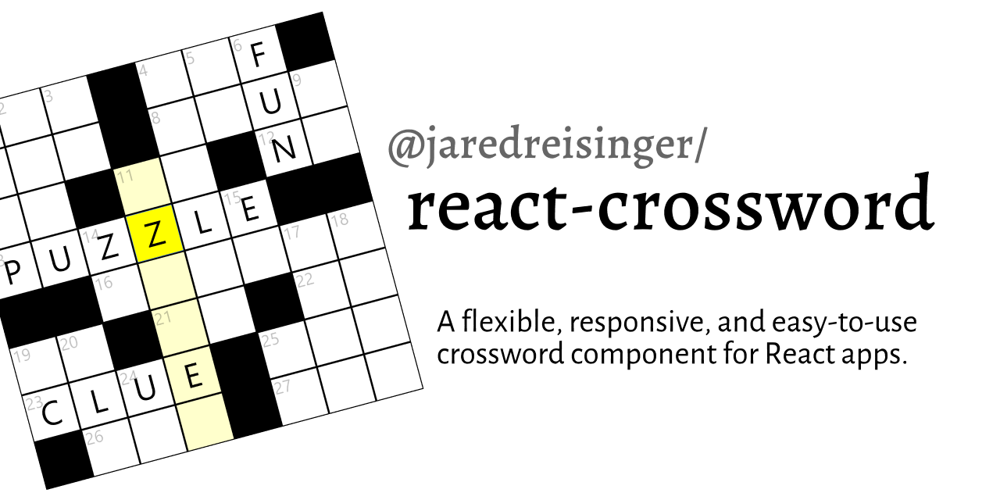

# 

[](https://www.npmjs.com/package/@jaredreisinger/react-crossword)
[](https://travis-ci.org/JaredReisinger/react-crossword)
[](https://codecov.io/gh/JaredReisinger/react-crossword)<br />
[](https://snyk.io/test/github/JaredReisinger/react-crossword?targetFile=package.json)
[](https://david-dm.org/JaredReisinger/react-crossword)
[](https://david-dm.org/JaredReisinger/react-crossword?type=dev)
[](https://david-dm.org/JaredReisinger/react-crossword?type=peer)<br />
[](./LICENSE)

[](http://commitizen.github.io/cz-cli/)
[](https://github.com/semantic-release/semantic-release)

## Install

```sh
npm install --save @jaredreisinger/react-crossword
  # or #
yarn add @jaredreisinger/react-crossword
```

## Usage

> See also the [styleguidist docs for Crossword](https://jaredreisinger.github.io/react-crossword/).

```javascript
import React from 'react';

import Crossword from '@jaredreisinger/react-crossword';

const data = {
  /* ... puzzle data (see below) ... */
};

export default function MyPage() {
  return <Crossword data={data} />;
}
```

### Clue/data format

To make crosswords as easy to create as possible, with the least amount of extraneous and boilerplate typing, the clue/answer format is structured as a set of nested objects:

```javascript
{
  across: {
    1: {
      clue: 'one plus one',
      answer: 'TWO',
      row: 0,
      col: 0,
    },
  },
  down: {
    2: {
      clue: 'three minus two',
      answer: 'ONE',
      row: 0,
      col: 2,
    },
  },
}
```

At the top level, the `across` and `down` properties group together the clues/answers for their respective directions. Each of those objects is a map, keyed by the answer number rather than an array. (This is done so that the creator has control over the numbering/labelling of the clues/answers.) Each item contains a `clue` and `answer` property, as well as `row` and `col` for the starting position.

The `Crossword` component calculates the needed grid size from the data itself, so you don't need to pass an overall size to the component.

## Styling

One other major difference (and advantage) to this crossword component is that it is very "stylable"... as many of the styling properties as possible are exposed so that you can create any look you want for the crossword. The `Crossword` component makes use of [styled-components' `ThemeProvider`](https://styled-components.com/docs/advanced#theming) and offers the following properties to control colors and layout:

| theme property        | default               | description                                                                                                                                                                 |
| --------------------- | --------------------- | --------------------------------------------------------------------------------------------------------------------------------------------------------------------------- |
| `columnBreakpoint`    | `'768px'`             | browser-width at which the clues go from showing beneath the grid to showing beside the grid.                                                                               |
| `gridBackground`      | `'rgb(0,0,0)'`        | overall background color (fill) for the crossword grid. Can be `'transparent'` to show through a page background image.                                                     |
| `cellBackground`      | `'rgb(255,255,255)'`  | background for an answer cell                                                                                                                                               |
| `cellBorder`          | `'rgb(0,0,0)'`        | border for an answer cell                                                                                                                                                   |
| `textColor`           | `'rgb(0,0,0)'`        | color for answer text (entered by the player)                                                                                                                               |
| `numberColor`         | `'rgba(0,0,0, 0.25)'` | color for the across/down numbers in the grid                                                                                                                               |
| `focusBackground`     | `'rgb(255,255,0)'`    | background color for the cell with focus, the one that the player is typing into                                                                                            |
| `highlightBackground` | `'rgb(255,255,204)'`  | background color for the cells in the answer the player is working on, helps indicate in which direction focus will be moving; also used as a background on the active clue |

Note that these values can be provided either via `ThemeProvider`, or directly as a `theme` property on the `Crossword` component itself. (And further, if you're not using styled-components, but want to make use of `ThemeProvider`, this library re-exports `ThemeProvider` so you can pull it from here.)

Also, several class names are applied to elements in the crossword, in case you want to apply styles that way:

| element                                                              | class name  |
| -------------------------------------------------------------------- | ----------- |
| entire crossword component; encompassing grid and clues              | `crossword` |
| entire crossword is correct (on same element as `crossword`)         | `correct`   |
| answer grid                                                          | `grid`      |
| all of the clues                                                     | `clues`     |
| header and clues for one direction                                   | `direction` |
| direction header ('across' or 'down')                                | `header`    |
| an individual clue                                                   | `clue`      |
| an individual clue with a correct answer (on same element as `clue`) | `correct`   |

(No class names are currently applied within the grid, as the SVG layout is _**very**_ layout-sensitive.)

## Player progress events

In addition to providing properties for styling, there are some properties to
help your application "understand" the player's progress:

| property             | description                                                                                                                                                                                                                                                |
| -------------------- | ---------------------------------------------------------------------------------------------------------------------------------------------------------------------------------------------------------------------------------------------------------- |
| `onCorrect`          | callback function that fires when a player answers a clue correctly; called with `(direction, number, answer)` arguments, where `direction` is `'across'` or `'down'`, `number` is the clue number as text (like `'1'`), and `answer` is the answer itself |
| `onLoadedCorrect`    | callback function that's called when a crossword is loaded, to batch up correct answers loaded from storage; passed an array of the same values that `onCorrect` would recieve                                                                             |
| `onCrosswordCorrect` | callback function that's called when the overall crossword is completely correct (or not)                                                                                                                                                                  |
| `onCellChange`       | callback function called when a cell changes (e.g. when the user types a letter); passed the row and column and the character typed                                                                                                                        |

### Imperative methods

The following imperative methods can be called on a "ref" handle to the component:

| method name            | parameters | description                                                                                         |
| ---------------------- | ---------- | --------------------------------------------------------------------------------------------------- |
| `focus()`              | _(none)_   | Sets focus to the crossword component.                                                              |
| `reset()`              | _(none)_   | Resets the entire crossword; clearing all answers in the grid and also any persisted data.          |
| `fillAllAnswers()`     | _(none)_   | Fills all the answers in the grid and calls the `onLoadedCorrect` callback with _**every**_ answer. |
| `isCrosswordCorrect()` | _(none)_   | Returns whether the crossword is entirely correct or not.                                           |

## Background

Initially written as a replacement for `@guardian/react-crossword`, to make custom styling and puzzle-definition easier.

There are several things about the Crossword component from `@guardian/react-crossword` that are less than ideal, in my opinion:

- the styles/formatting are baked in
- semi-unrelated functionality like the "anagram helper" is baked in
- the data format for clues/answers is horrendous

This is an attempt to create a less-opinionated component that's much easier to drop in to an arbitrary React page.

## License

[MIT](./LICENSE), © 2020 [Jared Reisinger](https://github.com/JaredReisinger)
